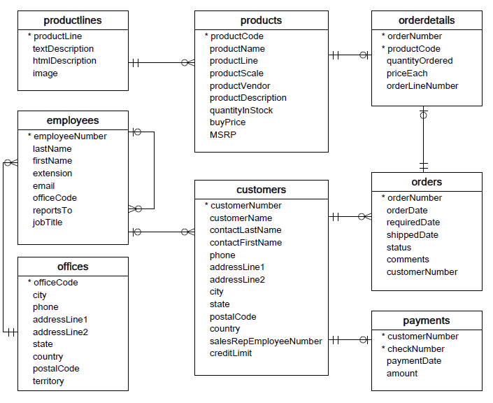
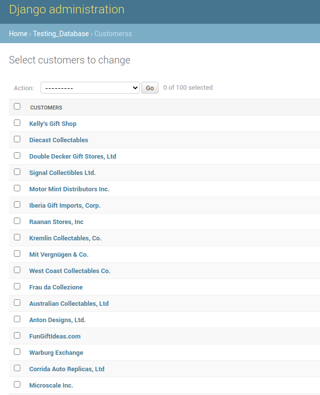
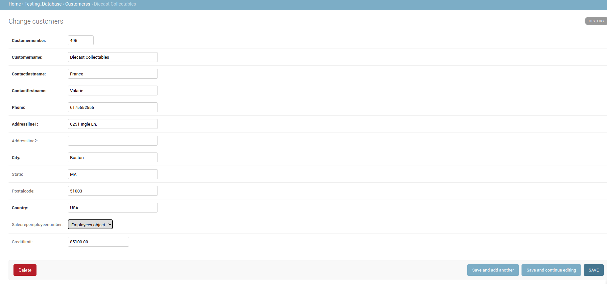

# Connecting Django 1.11 to legacy MySQL 5.5.48 database with python 2.7

1. Create docker compose with python 2.7, django 1.11 and MySql 5.5.48. 
   * There is need to have `mysqlclient` package in requirements in order to connect to MySQL.
   * There is need to install `libmysqlclient-dev` library as a dependency of mysqlclient.

2. Add script to create database and create tables with realations.  I have used a sample database from [here](https://www.mysqltutorial.org/mysql-sample-database.aspx).

   Schema diagram:

   

3. In django settings file change database to MySQL.

4. To automatically inspect models in a connected database with django: `python manage.py inspectdb > models.py`. It will create models.py module with models which are currently in the database. (Generated models for this db are in `testing_database/models`)
   * If inspectdb cannot map a column’s type to a model field type, it’ll use TextField and will insert the Python comment 'This field type is a guess.' next to the field in the generated model.
   * If the database column name is a Python reserved word (such as 'pass', 'class' or 'for'), inspectdb will append '_field' to the attribute name. For example, if a table has a column 'for', the generated model will have a field 'for_field', with the db_column attribute set to 'for'. inspectdb will insert the Python comment 'Field renamed because it was a Python reserved word.' next to the field.
   * By default, inspectdb creates unmanaged models. That is, managed = False in the model’s Meta class tells Django not to manage each table’s creation, modification, and deletion. If you do want to allow Django to manage the table’s lifecycle, you’ll need to change the managed option to True (or simply remove it because True is its default value).
   * Models may need some tweaks like string representation and in particular, need to rearrange models’ order, so that models that refer to other models are ordered properly. 

5. After inspection and tweaks of models you can copy them into some django app and make migrations.

6. After adding generated tables to admin I can inspect, add and change records without problem: 
   
   
   

[Django 1.11 documentation for it.](https://docs.djangoproject.com/en/1.11/howto/legacy-databases/)
